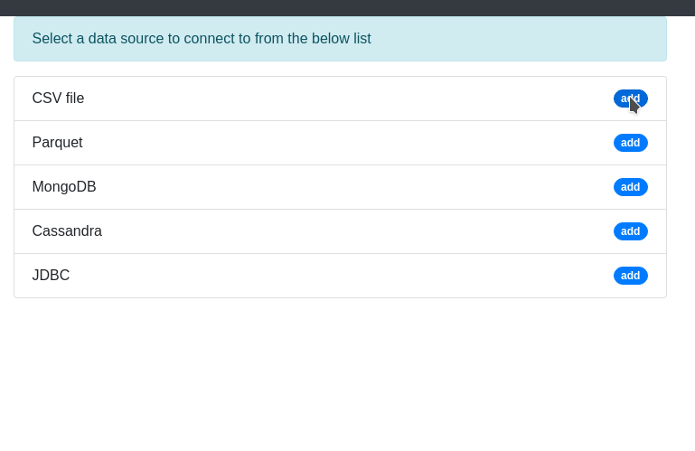
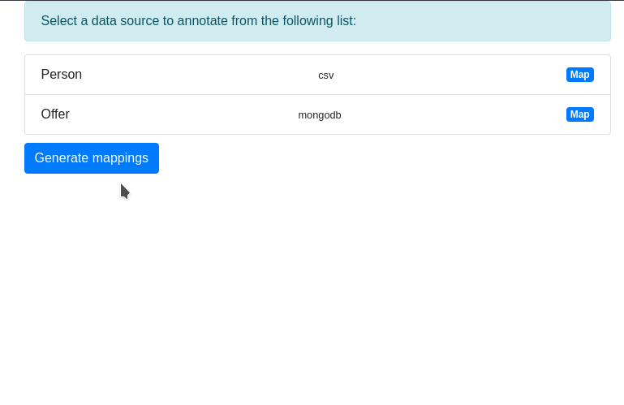
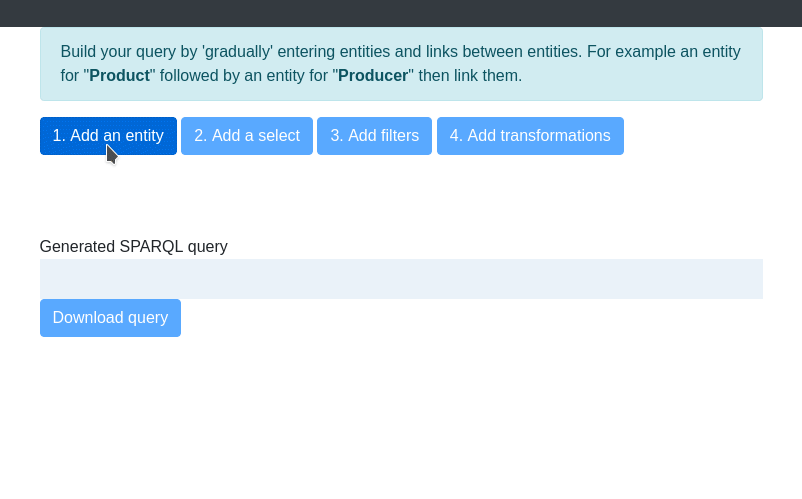

[](https://gitter.im/Squerall)

# Squerall-GUI
Squerall-GUI is the user interface of [Squerall](https://github.com/EIS-Bonn/Squerall) --a solution for querying Data Lakes in a unified manner. Squerall-GUI produces three input files used by Squerall to execute queries: 

- **Config:** It stores information needed to connect to a data source, e.g., host, port, user, password, cluster name, replicas number, etc.
- **Mappings:** A dedicate database (embedded) storing mappings between data and ontology terms.
- **Query:** SPARQL query to pass to Squerall for execution.

## Configuration
Open `conf/application.conf` file and set values for the following configuration options:
- `sourcesConfFile` and `mappingsDB` point to the path of the config file and mappings database, respecitvely.
```json
sourcesConfFile = "/path/to/config"
mappingsDB = "/path/to/mappings.db"
```

- `pathToParquetToolsJar` points to where _parquet-tools_ JAR is stored. _parquet-tools_ is an external tool that Squerall uses to extract schema from a Parquet files (see **2. Mappings UI** below). It can be downloaded from [here](http://central.maven.org/maven2/org/apache/parquet/parquet-tools/1.10.1/parquet-tools-1.10.1.jar).

```json
pathToParquetToolsJar="/path/to/parquet-tools-1.10.1.jar"
```

- `play.http.secret.key` stores the application secret key (needed for real production deployment, see [here](https://www.playframework.com/documentation/2.7.x/ApplicationSecret) for explanation). The key can either be set manually (minimum eight charecters) or generated using the command: `bash sbt playGenerateSecret`. 
```
play.http.secret.key="UtdjTsV32Dus<E1UDs:Xv]YE]UENJvJ7U9ei@L@MIb/`iG^obB_oBLs3z<kpotg72"
play.http.secret.key=${?APPLICATION_SECRET}
```

## Execution
To build and run Squerall-GUI, run the following commands from the root of the project:

```bash
sbt compile
sbt runProd
```
Or directly `sbt runProd`.

Squerall-GUI can then be opened by navigating to [localhost:9000/squerall](localhost:9000/squerall).

## Usage
Squerall-GUI consists of three interfaces:
### 1. Connection UI
It is used to generate the **config** file, it shows users the options they need to provide in order to connect to a data source. Those are Spark and Presto options, an example of MongoDB options in Spark can be found [here](https://docs.mongodb.com/spark-connector/master/configuration/), and in Presto [here](https://prestodb.github.io/docs/current/connector/mongodb.html).




### 2. Mappings UI
Using the information collected by the previous GUI, data schema is extracted showed to the user. The user searches for Ontology properties and classes to map data attributes and entities. The search is powered by the [LOV catalog](https://lov.linkeddata.es/dataset/lov/), but users can enter their own terms.


Mappings are saved in their dedicated database, users use this interface to generate the **mappings** file used by Squerall to query the data.



### 3. Query UI
It guides users through the creation of SPARQL queries. Users provide input to widgets, and the interface creates the query for them. The interface auto-suggests Ontology terms from the mappings collected by the previous interface. This interface helps users create queries that potentially return results; e.g., if they choose terms not known in the mappings, the query will not return results.



## Try it
A Dockerfile is available to have a quick look at Squerall-GUI. Navigate to the root of the repo (where Dockerfile is located) and then run:
```
sudo docker build -t squerall-gui . # wait till finished
sudo docker run -p 9000:9000 -it --rm squerall-gui
```
Once done, open your browser at `localhost:9000/squerall`.

To see the generated config files, you need to _log in_ to the container by opening a bash inside it. To do so, run `sudo docker ps` and note the container name/id running the squerall-gui image. Then run:
```
sudo docker exec -it [container_ID/name] bash
```
Once in the bash, navigate to `cd /usr/local/squerall-gui/conf`, there you find `config` and `mappings.ttl` files.

Or, watch a walkthrough screencasts at: https://drive.google.com/drive/folders/10mkwMrbuxv71gtwE2etDzqANt8S9YXhr

## Technology
Squerall-GUI is built using the open-source [Play Framework (v2.7.0)](https://www.playframework.com/documentation/2.7.x/Home) in Scala language. It makes use of [Nitrite database](https://www.dizitart.org/nitrite-database.html) as a light-weight embedded document database.

## Contact
For any inquiries, please contact me on: mami@cs.uni-bonn.de, or ask directly on [Gitter chat](https://gitter.im/squerall).

License
-------

This project is openly available under the terms of the __Apache License
v2.0__ ([read for more](./LICENSE)).
